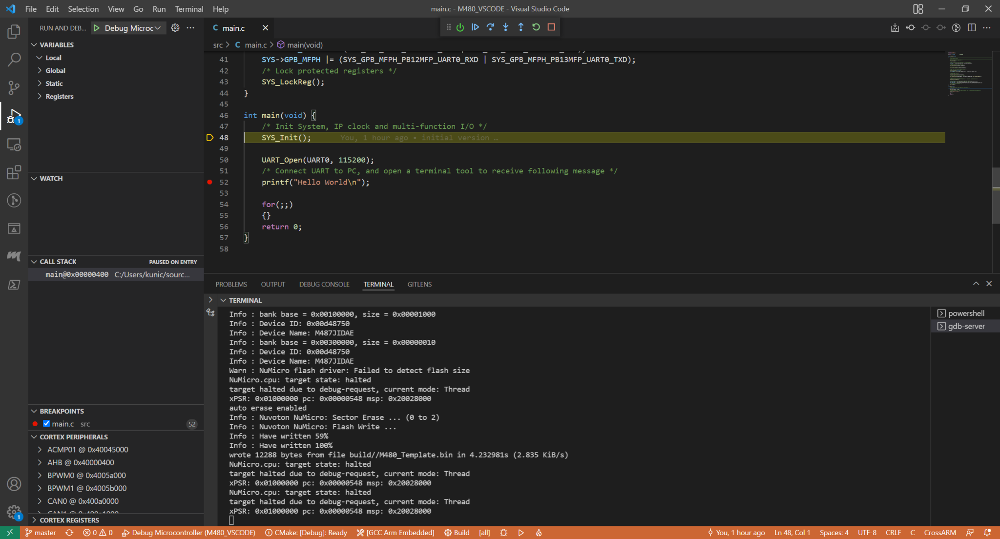
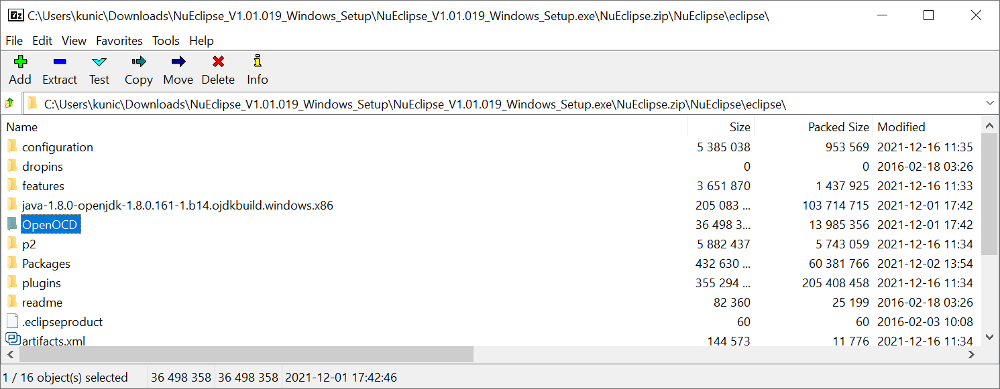

Nuvoton M480 with Visual Studio Code development environment
===

the repository use submodule for M480 BSP and import lwIP v2.1.3 with FreeRTOS LTS v2021.12.02

[GCC ARM 10.3-2021.10 for Win32 toolchain](https://developer.arm.com/-/media/Files/downloads/gnu-rm/10.3-2021.10/gcc-arm-none-eabi-10.3-2021.10-win32.exe)

Debugging and flash use [OpenOCD-Nuvoton](https://github.com/OpenNuvoton/OpenOCD-Nuvoton), the prebuild executes file in [NuEclipse](https://www.nuvoton.com/tool-and-software/ide-and-compiler/)

Debugging
---

prebuild OpenOCD in NuEclipse install package
---

