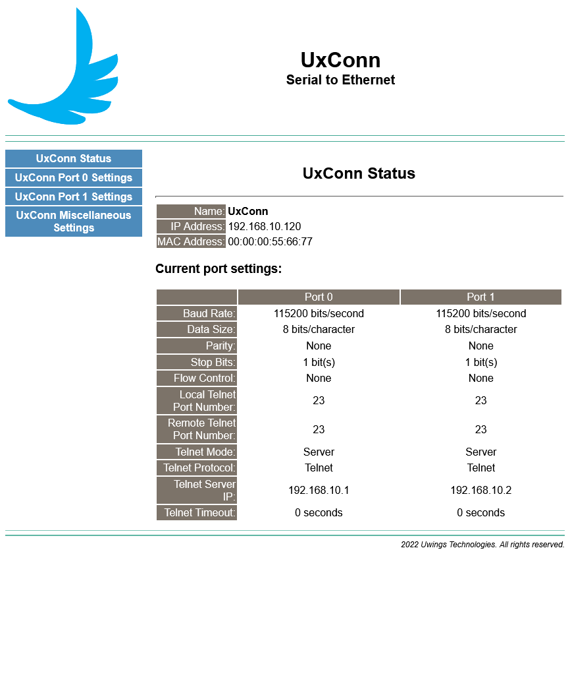
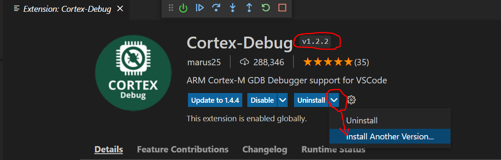

Nuvoton M480 with Visual Studio Code development environment
===

the repository use submodule for M480 BSP and import lwIP v2.1.3 with FreeRTOS LTS v2021.12.02
to implement Ethernet to Serial

* press key **\<CTRL>+\<SHIFT>+B** for launch build task
* press key **F5** for lauch debugging task

Flash methods by **Nu-Link**
1. press **\<CTRL>+\<SHIFT>+P** for Open the Command Palette, then select **Tasks:Run Task/Flash"
1. press key **\<CTRL>+P** then keyin **task flash with \<Enter>**, will update application by Nu-Link

Visual Studio Code need install the below extensions
* [ms-vscode.cpptools](https://marketplace.visualstudio.com/items?itemName=ms-vscode.cpptools)
* [marus25.cortex-debug v1.2.2 (don't use v1.4.x)](https://marketplace.visualstudio.com/items?itemName=marus25.cortex-debug)
* [ms-vscode.cmake-tools](https://marketplace.visualstudio.com/items?itemName=ms-vscode.cmake-tools)

and need install the below toolchain and build tools
* [GCC ARM 10.3-2021.10 for Win32 toolchain](https://developer.arm.com/-/media/Files/downloads/gnu-rm/10.3-2021.10/gcc-arm-none-eabi-10.3-2021.10-win32.exe)
* [CMake 3.15.3 and later](https://cmake.org/download/)

Debugging and flash use [OpenOCD-Nuvoton](https://github.com/OpenNuvoton/OpenOCD-Nuvoton), the prebuild executes file in [NuEclipse](https://www.nuvoton.com/tool-and-software/ide-and-compiler/)

Screenshot
---

Debugging
---

Coretex-Debug extension v1.2.2
--
please keep Cortex-Debug is v1.2.2, don't use v1.4.0 ~ v1.4.x.
currently the new version not work with OpenOCD (v0.10)
you can reference the below picture for downgrade action

------
Ethernet to Serial
===
implement two port to use the below UART instances

1. Port0: UART1
2. Port1: UART5

Port0 hardware configuration
* GPIO PH8 - TXD
* GPIO PH9 - RXD
* GPIO PB8 - RTS
* GPIO PB9 - CTS

Port1 hardware configuration
* GPIO PB2 - CTS
* GPIO PB3 - RTS
* GPIO PB4 - RXD
* GPIO PB5 - TXD

Reference
---
* [Visual Studio Code for C/C++](https://mcuoneclipse.com/2021/05/01/visual-studio-code-for-c-c-with-arm-cortex-m-part-1/)
* [NuMaker-PFM-M487 Schematic v3.0](docs/PFM-M487/NUMAKER-PFM-M487_V3_0.pdf)
* [NuMaker-PFM-M487 User Manual Rev1.01](docs/PFM-M487/UM_NuMaker-PFM-M487_User_Manual_EN_Rev1.01.pdf)
